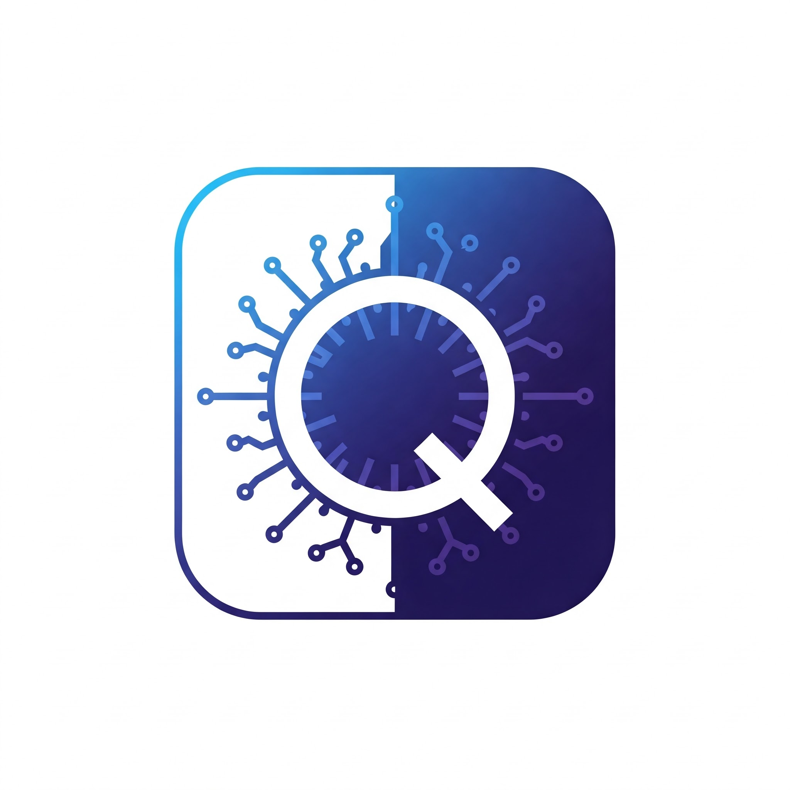

# Quasar - AI Crypto Analysis on Sonic Blockchain



Quasar is an AI-powered decentralized application built on the Sonic Blockchain that enables users to interact with an advanced AI agent for comprehensive crypto market analysis and informed decision-making.

## 🔮 Vision & Mission

Quasar aims to democratize access to sophisticated crypto market analysis by leveraging artificial intelligence and blockchain technology. Our mission is to provide retail investors with the same level of analytical capabilities that were previously only available to institutional investors.

By combining real-time market data, sentiment analysis, and AI-driven insights, Quasar helps users make more informed decisions in the volatile cryptocurrency market. The platform is built on Sonic Blockchain to ensure fast, low-cost transactions and a seamless user experience.

## 🌟 Features

- **Sonic Blockchain Integration**: Seamlessly connect to Sonic Blaze Testnet
- **AI-Powered Analysis**: Chat with a sophisticated AI assistant for real-time crypto market insights
- **Reddit Sentiment Analysis**: Analyze community sentiment from r/0xSonic and other crypto subreddits
- **Live Crypto Data**: Real-time price tracking, market cap, volume, and percentage changes
- **News Aggregation & Analysis**: Curated crypto news with AI-generated sentiment analysis
- **Market Intelligence**: Get detailed analysis on trends, price movements, and investment opportunities
- **User-Friendly Interface**: Modern, responsive UI built with Next.js, TypeScript, and Tailwind CSS
- **Secure Wallet Connection**: Easy wallet integration with RainbowKit
- **Floating Chatbot**: Access AI assistance from any page in the application

## 🏗️ Architecture

Quasar follows a modern web application architecture with several key components:

### Frontend
- **Next.js App Router**: For server-side rendering and optimized page loading
- **React Components**: Modular UI components for reusability and maintainability
- **TailwindCSS**: Utility-first CSS framework for responsive design
- **Framer Motion**: For smooth animations and transitions

### Blockchain Integration
- **RainbowKit/wagmi**: For wallet connection and blockchain interactions
- **Ethers.js**: For Ethereum-compatible blockchain communication
- **Sonic Blockchain**: EVM-compatible chain for fast, low-cost transactions

### AI & Data Processing
- **OpenAI API**: Powers the AI assistant and sentiment analysis
- **LiveCoinWatch API**: For real-time cryptocurrency market data
- **Reddit API**: For community sentiment analysis
- **News Aggregation**: RSS feeds from major crypto news sources

### Data Flow
1. Market data is fetched from LiveCoinWatch API
2. News is aggregated from various crypto news sources
3. Reddit posts are analyzed for community sentiment
4. User queries are processed by the AI assistant
5. Blockchain transactions are handled via Sonic Blockchain

## 🔗 Sonic Blockchain Details

- **Network Name**: Sonic Blaze Testnet
- **RPC URL**: https://rpc.blaze.soniclabs.com
- **Explorer URL**: https://testnet.sonicscan.org
- **Chain ID**: 57054
- **Currency Symbol**: S
- **Faucet**: https://testnet.soniclabs.com/account

## 🚀 Getting Started

### Prerequisites

- Node.js 18+ and npm
- MetaMask or any EVM-compatible wallet
- OpenAI API key for AI functionality
- LiveCoinWatch API key for market data

### Installation

1. Clone the repository:
   ```bash
   git clone https://github.com/JuinSoft/Quasar
   cd quasar
   ```

2. Install dependencies:
   ```bash
   npm install
   ```

3. Create a `.env.local` file in the root directory with your API keys:
   ```
   NEXT_PUBLIC_OPENAI_API_KEY=your_openai_api_key
   NEXT_PUBLIC_LIVECOINWATCH_API_KEY=your_livecoinwatch_api_key
   NEXT_PUBLIC_WALLET_CONNECT_PROJECT_ID=your_walletconnect_project_id
   ```

4. Start the development server:
   ```bash
   npm run dev
   ```

5. Open [http://localhost:3000](http://localhost:3000) in your browser.

## 📱 Usage

1. **Connect Wallet**: Connect your wallet to the Sonic Blaze Testnet using the "Connect Wallet" button
2. **Get Test Tokens**: If you need test tokens, visit the [Sonic Faucet](https://testnet.soniclabs.com/account)
3. **AI Assistant**: Use the floating chatbot in the bottom-right corner to ask questions about crypto markets, trends, or investment strategies
4. **Live Crypto Data**: View real-time cryptocurrency prices, market caps, and percentage changes
5. **Reddit Sentiment**: Analyze community sentiment from the r/0xSonic subreddit
6. **News Analysis**: Read the latest crypto news with AI-generated sentiment analysis
7. **Market Analysis**: Get detailed market analysis with buy/sell/hold recommendations

## 🧠 AI Capabilities

Quasar's AI assistant can:

- **Answer Questions**: Provide information about cryptocurrencies, blockchain technology, and market trends
- **Analyze Sentiment**: Determine if news articles or social media posts are positive, negative, or neutral
- **Generate Recommendations**: Suggest whether to buy, sell, or hold based on market data and sentiment
- **Explain Concepts**: Break down complex crypto and blockchain concepts in simple terms
- **Track Trends**: Identify emerging trends in the cryptocurrency market
- **Personalize Insights**: Tailor recommendations based on user preferences and risk tolerance

## 🛠️ Technologies Used

- **Frontend**: 
  - Next.js 15 (App Router)
  - React 19 (Server Components)
  - TypeScript 5
  - Tailwind CSS 4
  - Framer Motion

- **Blockchain**: 
  - Ethers.js
  - RainbowKit/wagmi
  - Web3Modal
  - Sonic Blockchain (EVM-compatible)

- **AI & Data**: 
  - OpenAI API (GPT models)
  - LiveCoinWatch API
  - Reddit API
  - RSS Parser for news aggregation
  - Axios for API requests

- **Development Tools**:
  - ESLint
  - Prettier
  - Turbopack
  - Node.js

## 📊 Key Components

### 1. FloatingChatbot
A persistent chatbot that follows the user across all pages, providing AI assistance whenever needed.

### 2. RedditSentimentAnalysis
Analyzes posts from r/0xSonic to gauge community sentiment and identify trending topics.

### 3. LiveCryptoData
Displays real-time cryptocurrency data with price changes, market cap, and volume.

### 4. SonicCoinInfo
Provides detailed information about the Sonic token, including price, supply, and historical data.

### 5. SonicNews
Aggregates and analyzes news related to Sonic and the broader cryptocurrency market.

### 6. Market Analysis
AI-powered analysis of cryptocurrency markets with actionable insights and recommendations.

## 🧪 Development

```bash
# Run development server with Turbopack
npm run dev

# Build for production
npm run build

# Start production server
npm run start

# Run linting
npm run lint
```

## 🔄 API Integration

### LiveCoinWatch API
Used to fetch real-time cryptocurrency data:
- Price information
- Market capitalization
- Trading volume
- Historical data
- Percentage changes

### OpenAI API
Powers the AI capabilities:
- Natural language processing
- Sentiment analysis
- Market predictions
- Content generation
- Query understanding

### Reddit API
Used for community sentiment analysis:
- Post aggregation
- Comment analysis
- Sentiment scoring
- Trend identification

## 🔮 Future Roadmap

1. **Q3 2025**: 
   - Mobile application release
   - Advanced technical analysis tools
   - Community governance features

4. **Q4 2025**: 
   - Multi-chain portfolio management
   - AI-powered DeFi strategy recommendations
   - Institutional-grade analytics

## 🤝 Contributing

Contributions are welcome! Please feel free to submit a Pull Request.

1. Fork the repository
2. Create your feature branch (`git checkout -b feature/amazing-feature`)
3. Commit your changes (`git commit -m 'Add some amazing feature'`)
4. Push to the branch (`git push origin feature/amazing-feature`)
5. Open a Pull Request

## 🔍 Troubleshooting

### Common Issues

1. **Wallet Connection Issues**:
   - Ensure you're connected to the Sonic Blaze Testnet
   - Check that your wallet has the correct RPC settings

2. **API Rate Limiting**:
   - LiveCoinWatch API has a daily limit of 10,000 requests
   - OpenAI API may have rate limits based on your subscription

3. **Build Errors**:
   - Make sure all dependencies are installed
   - Check that your environment variables are correctly set

## 📄 License

This project is licensed under the MIT License - see the LICENSE file for details.

## 🙏 Acknowledgements

- Sonic Blockchain for providing the EVM-compatible blockchain infrastructure
- OpenAI for the AI capabilities
- LiveCoinWatch for cryptocurrency market data
- The open-source community for various libraries and tools used in this project

## 📞 Contact

For questions or support, please open an issue in the GitHub repository or contact the project maintainers.
